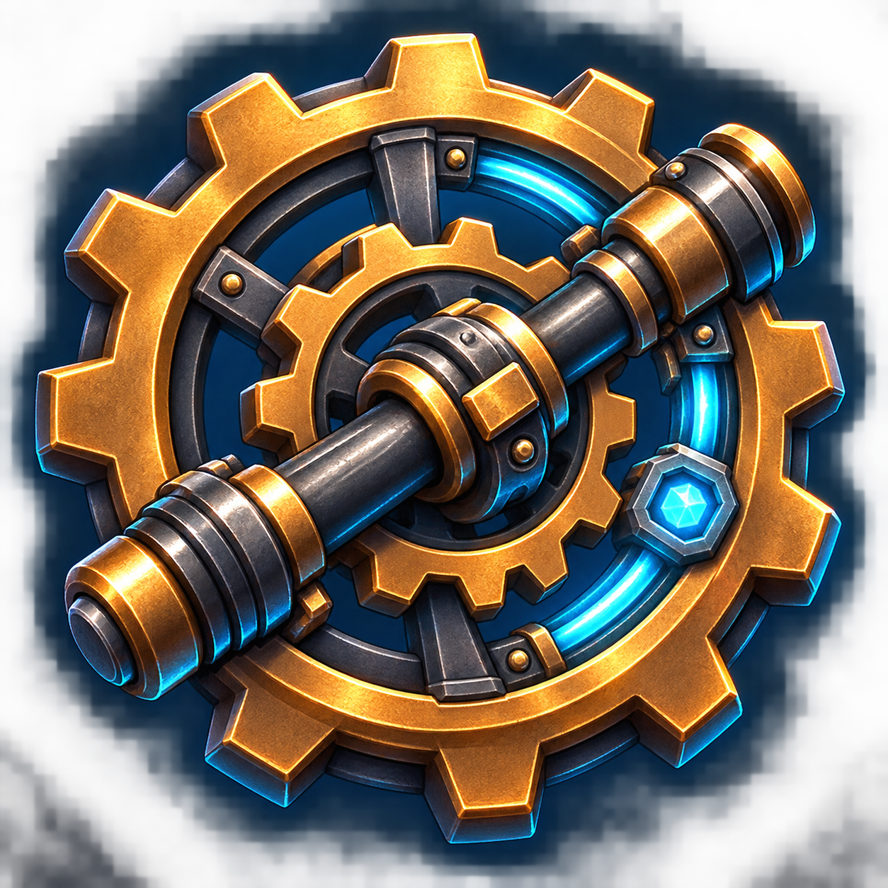

<p align="center">
  
</p>

# Create: Adapted

Create: Adapted is an unofficial adaptation of Create 6.0.10 for Minecraft
26.2 and NeoForge. It ports Create's mechanical automation, kinetic systems,
moving contraptions, processing machines, trains, tools, and decorative blocks
to the newer game version.

> [!IMPORTANT]
> This is an experimental community adaptation. It is not affiliated with or
> endorsed by the original Create development team. Back up important worlds
> before installing or updating it.

## Compatibility

- Minecraft 26.2
- NeoForge 26.2.0.18-beta
- Create: Adapted 0.8
- External asset source: official Create 6.0.10 for Minecraft 1.21.1
- Optional JEI integration tested with JEI 30.11.0.67
- Java 25

Compatibility with every Minecraft 26.2 mod is not guaranteed. Mods that
directly integrate with Create, Flywheel, Registrate, Ponder, or Create's
internal APIs may require separate updates.

## Installation

1. Install NeoForge 26.2.0.18-beta.
2. Put `create-26.2-0.8-public-external-assets.jar` in the game instance's
   `mods` folder.
3. Launch the game once. Create: Adapted will create a `create_original`
   folder in the game directory.
4. Download `create-1.21.1-6.0.10.jar` from the
   [official Create CurseForge page](https://www.curseforge.com/minecraft/mc-mods/create/files/all?page=1&pageSize=20&version=1.21.1).
5. Put the official jar in `<game directory>/create_original/` and restart the
   game.

Do **not** put the original Create 6.0.10 jar in `mods`. Both jars use the
`create` mod id, so doing that would cause a duplicate-mod conflict.

The adapted Flywheel, Ponder, Catnip, and Registrate libraries are embedded.
No separate library downloads are required. JEI is optional and the game can
start without it.

## External assets and licensing

This public repository and its release jar do not redistribute Create's
original textures, models, sounds, fonts, or artwork. The upstream project
marks those assets All Rights Reserved.

At runtime, the client mounts resources from the official Create jar supplied
by the player. The original jar's program code is not added to the mod
classpath and is not executed. Only its resources are used.

The source code is available under the [MIT License](LICENSE.md). The original
Create copyright notice is retained. The external upstream artwork is not
covered by this repository's MIT license.

See [EXTERNAL_ASSETS.md](EXTERNAL_ASSETS.md) for the complete asset setup.

## Dedicated servers

A dedicated server needs only the Create: Adapted jar in its `mods` folder.
The official Create 6.0.10 asset jar is client-side and is not required on the
server. Every connecting player must configure their local `create_original`
folder.

## Rendering

The public external-assets edition defaults to Flywheel's compatibility
renderer (`flywheel:off`) for reliable rendering of resources mounted at
runtime. This setting does not disable Create machines, movement, or
animations.

## Building

Use Java 25 and run:

```text
./gradlew build
```

The public jar task contains an asset allowlist. Only the adaptation's JSON
compatibility layer and original Create: Adapted branding are packaged.

## Reporting problems

Open an issue with:

- the latest game log;
- the installed mod list;
- exact NeoForge and JEI versions;
- steps that reproduce the problem.

Future updates will focus on wider mod compatibility, rendering and animation
fixes, optional integrations, and support for newer NeoForge and JEI versions.

## Support the project

If you would like to support the development, testing, and maintenance of
Create: Adapted, you can [donate through StreamElements](https://streamelements.com/bugsgify/tip).

Other donation options:

- **Bitcoin (BTC):** `13R6PfZET4WSoQMXFJorDLKPVmdCWRWQgb`
- **Ethereum (ERC-20):** `0xc96dd229eadb606a6e5485a8aa05dbd43f81b8fd`
- **USDT (TRC-20):** `TNdo4pTSRnhEgoJqjmPdzMySp1pwSr6VLF`
- **PayPal:** `AlexNeo2014@hotmail.com`

Please verify the selected cryptocurrency and network before sending a
payment. Transfers sent through an incompatible network may be permanently
lost.

Donations support this unofficial adaptation only. They do not provide access
to the original Create assets and are not connected to the official Create
development team.
